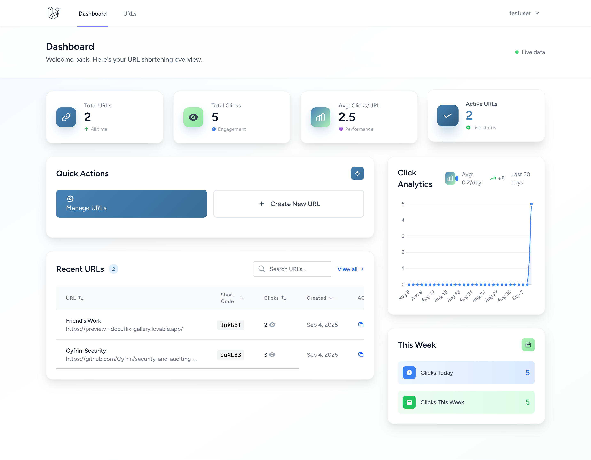

# 🔗 Smart URL Shortener

<p align="center">
  
  
  
  
</p>

<p align="center">A modern, feature-rich URL shortening service with real-time analytics and beautiful UI</p>

## ✨ Features

### Core Functionality
- 🔗 **Smart URL Shortening** - Generate short, memorable links
- 📊 **Real-time Analytics** - Track clicks, locations, devices, and referrers
- 👤 **User Authentication** - Secure user accounts with dashboard access
- 📱 **Responsive Design** - Beautiful UI that works on all devices
- ⚡ **Fast Performance** - Optimized database queries and caching

### Analytics & Tracking
- 📈 **Click Analytics** - Detailed click tracking with charts
- 🌍 **Geographic Data** - Track clicks by location
- 📱 **Device Tracking** - Monitor desktop vs mobile usage
- 🔄 **Real-time Updates** - Live dashboard with animated counters
- 📅 **Time-based Analytics** - Daily, weekly, and monthly statistics

### User Experience
- 🎨 **Modern UI** - Clean, professional interface with animations
- 🌙 **Glassmorphism Design** - Modern visual effects and gradients
- ⚡ **Instant Feedback** - Real-time form validation and notifications
- 📊 **Interactive Dashboard** - Comprehensive metrics overview
- 🔍 **Search & Filter** - Easy URL management

<div align="center">
  
  <p><em>Modern landing page with glassmorphism design and intuitive URL shortening interface</em></p>
</div>

## 🛠️ Tech Stack

- **Backend**: Laravel 11, PHP 8.2+
- **Frontend**: Vue.js 3, Inertia.js, Tailwind CSS
- **Database**: SQLite (development), MySQL/PostgreSQL (production)
- **Build Tools**: Vite, Laravel Mix
- **Authentication**: Laravel Breeze
- **Charts**: Chart.js for analytics visualization

## 🚀 Quick Start

### Prerequisites
- PHP 8.2 or higher
- Composer
- Node.js 18+ and npm
- SQLite (for development)

### Local Development

1. **Clone the repository**
   ```bash
   git clone https://github.com/Pegasus-Prongs/url_shorten.git
   cd url_shorten
   ```

2. **Install PHP dependencies**
   ```bash
   composer install
   ```

3. **Install Node.js dependencies**
   ```bash
   npm install
   ```

4. **Environment setup**
   ```bash
   cp .env.example .env
   php artisan key:generate
   ```

5. **Database setup**
   ```bash
   touch database/database.sqlite
   php artisan migrate
   ```

6. **Build frontend assets**
   ```bash
   npm run dev
   ```

7. **Start the development server**
   ```bash
   php artisan serve
   ```

8. **Visit your application**
   Open `http://127.0.0.1:8000` in your browser

### Development Workflow

For active development, run both servers simultaneously:

```bash
# Terminal 1: Laravel server
php artisan serve --port=8001

# Terminal 2: Vite dev server (for hot reloading)
npm run dev
```

## 📦 Deployment Options

### 🌟 Recommended: Railway (Easiest)

**Perfect for beginners - Deploy in 5 minutes!**

1. **Prepare your project**
   ```bash
   # Create production build
   npm run build

   # Commit all changes
   git add .
   git commit -m "Ready for deployment"
   git push origin main
   ```

2. **Deploy to Railway**
   - Visit [railway.app](https://railway.app)
   - Sign up with GitHub
   - Click "New Project" → "Deploy from GitHub repo"
   - Select your repository
   - Railway auto-detects Laravel and deploys!

3. **Configure environment**
   - Go to your project → Variables tab
   - Add these variables:
     ```
     APP_ENV=production
     APP_DEBUG=false
     APP_URL=https://your-app.railway.app
     DB_CONNECTION=mysql
     ```
   - Railway automatically provides MySQL database

4. **Run migrations**
   - Go to Deployments → Click latest deployment
   - Open terminal and run: `php artisan migrate --force`

**Cost**: Free tier available, then $5/month

---

### 🚀 Alternative: Vercel (Great for Laravel)

**Excellent performance with serverless architecture**

1. **Install Vercel CLI**
   ```bash
   npm i -g vercel
   ```

2. **Prepare for deployment**
   ```bash
   # Build assets
   npm run build

   # Create vercel.json in project root
   ```

3. **Create `vercel.json`**
   ```json
   {
     "version": 2,
     "builds": [
       { "src": "api/index.php", "use": "vercel-php@0.6.0" },
       { "src": "public/**", "use": "@vercel/static" }
     ],
     "routes": [
       { "src": "/(.*)", "dest": "/api/index.php" }
     ],
     "env": {
       "APP_ENV": "production",
       "APP_DEBUG": "false"
     }
   }
   ```

4. **Deploy**
   ```bash
   vercel --prod
   ```

**Cost**: Free tier generous, then pay-as-you-go

---

### 💧 Alternative: DigitalOcean App Platform

**Balanced ease and control**

1. **Prepare deployment**
   ```bash
   npm run build
   git add . && git commit -m "Production build"
   git push origin main
   ```

2. **Create app**
   - Visit [DigitalOcean App Platform](https://cloud.digitalocean.com/apps)
   - Click "Create App" → Connect GitHub
   - Select your repository

3. **Configure build settings**
   ```yaml
   # Build Command
   composer install --no-dev --optimize-autoloader && npm ci && npm run build

   # Run Command
   php artisan serve --host=0.0.0.0 --port=$PORT
   ```

4. **Environment variables**
   ```
   APP_ENV=production
   APP_DEBUG=false
   APP_KEY=base64:your-key-here
   DB_CONNECTION=mysql
   ```

5. **Add database**
   - In app settings, add "Database" component
   - Choose MySQL or PostgreSQL

**Cost**: $5/month minimum

---

### 🔧 Production Configuration

**Essential environment variables for production:**

```bash
# Application
APP_ENV=production
APP_DEBUG=false
APP_URL=https://yourdomain.com
APP_KEY=base64:your-generated-key

# Database (MySQL/PostgreSQL recommended for production)
DB_CONNECTION=mysql
DB_HOST=your-db-host
DB_PORT=3306
DB_DATABASE=your-database
DB_USERNAME=your-username
DB_PASSWORD=your-password

# Mail (optional, for notifications)
MAIL_MAILER=smtp
MAIL_HOST=your-smtp-host
MAIL_PORT=587
MAIL_USERNAME=your-email
MAIL_PASSWORD=your-password
```

**Pre-deployment checklist:**
- [ ] Run `npm run build` for production assets
- [ ] Set `APP_ENV=production` and `APP_DEBUG=false`
- [ ] Configure production database
- [ ] Run `php artisan migrate --force` on production
- [ ] Set up SSL certificate (most platforms do this automatically)
- [ ] Configure custom domain (optional)

---

## 🎯 Usage

<div align="center">
  
  <p><em>Simple and intuitive URL shortening process with instant results</em></p>
</div>

### For End Users
1. **Visit your deployed app** (e.g., `https://your-app.railway.app`)
2. **Register an account** or use as guest
3. **Paste long URL** in the shortener
4. **Get short link** and share it
5. **Track analytics** in your dashboard

### For Developers
- **Dashboard**: `/dashboard` - View analytics and manage URLs
- **API Endpoints**: RESTful API for programmatic access
- **Admin Panel**: User management and system statistics

---

## 📊 Features Overview

| Feature | Description | Status |
|---------|-------------|--------|
| URL Shortening | Generate short links | ✅ |
| Click Tracking | Real-time analytics | ✅ |
| User Dashboard | Personal URL management | ✅ |
| Responsive Design | Mobile-friendly UI | ✅ |
| Real-time Charts | Interactive analytics | ✅ |
| Custom Domains | Brand your links | 🔄 Coming Soon |
| API Access | Programmatic integration | 🔄 Coming Soon |
| Bulk Operations | Mass URL management | 🔄 Coming Soon |

<div align="center">
  
  <p><em>Comprehensive analytics dashboard with real-time statistics and interactive charts</em></p>
</div>

---

## 🤝 Contributing

1. Fork the repository
2. Create a feature branch (`git checkout -b feature/amazing-feature`)
3. Commit your changes (`git commit -m 'Add amazing feature'`)
4. Push to the branch (`git push origin feature/amazing-feature`)
5. Open a Pull Request

---

## 📝 License

This project is open-sourced software licensed under the [MIT license](https://opensource.org/licenses/MIT).

---

## 🆘 Support

- **Documentation**: Check this README for setup instructions
- **Issues**: Report bugs via GitHub Issues
- **Discussions**: Use GitHub Discussions for questions

---

**Built with ❤️ using Laravel 11 and Vue.js 3**
